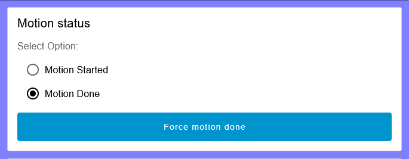
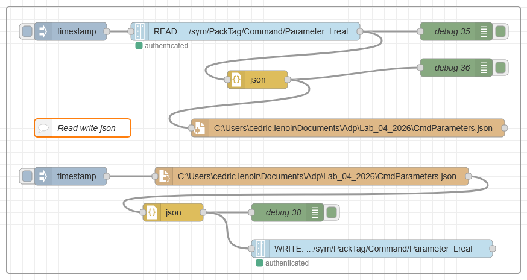
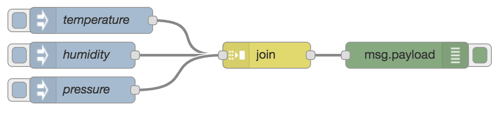
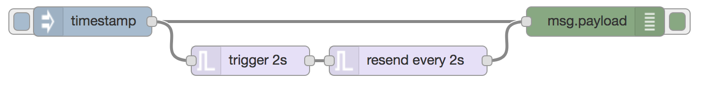
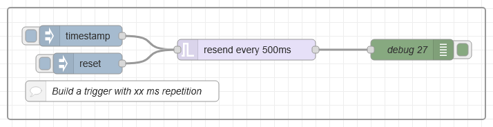
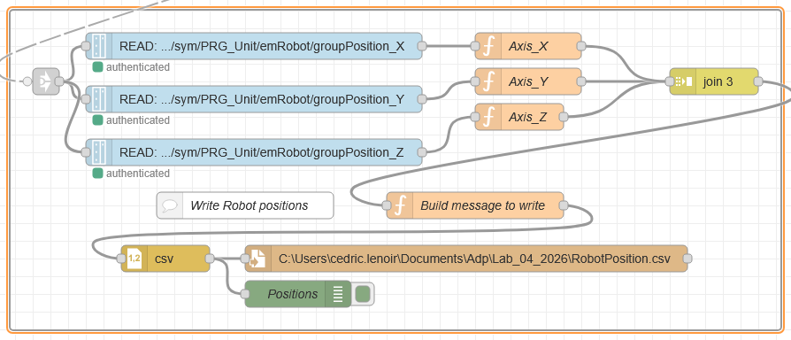
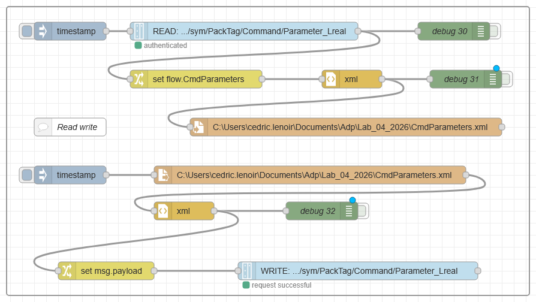
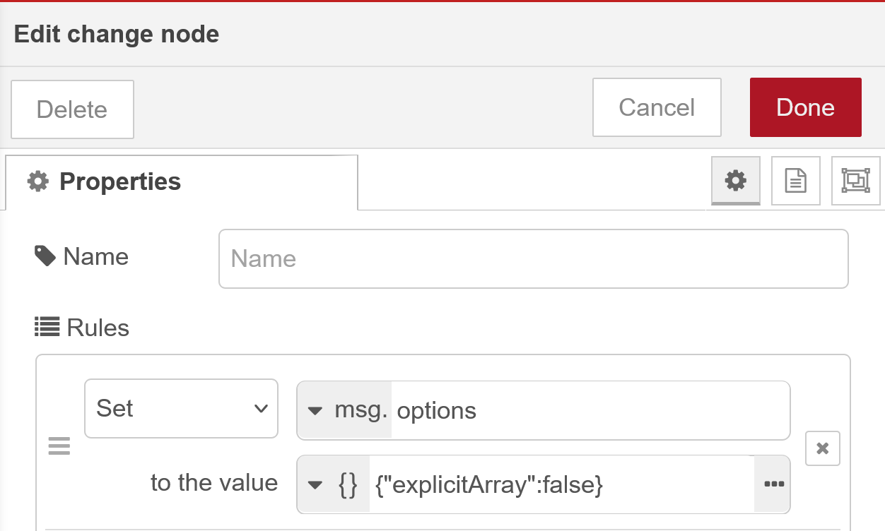

<h1 align="left">
  <br>
  
  <br>
  HEI-Vs Engineering School - DLS / Automation in Development and Production
  <br>
</h1>

Course DLS/ADP


Author: [Cédric Lenoir](mailto:cedric.lenoir@hevs.ch)

# Lab 04, Management of CSV and JSON files.

## We have these nodes

<div align="center">
<figure>
  <br>
  <figcaption>Node-RED parser</figcaption>
</figure>
</div>

**and**

<div align="center">
<figure>
  <br>
  <figcaption>Node-RED storage</figcaption>
</figure>
</div>

---

### We will use these nodes from Parser

#### CSV
To convert to from **CSV** format

<div align="center">
<figure>
  <br>
  <figcaption>Node-RED parser csv</figcaption>
</figure>
</div>

#### JSON
To convert to from **JSON** format

<div align="center">
<figure>
  <br>
  <figcaption>Node-RED parser json</figcaption>
</figure>
</div>

#### XML
To convert to from **XML** format

<div align="center">
<figure>
  <br>
  <figcaption>Node-RED parser xml</figcaption>
</figure>
</div>

---

### ... and these from Storage

#### Write file

<div align="center">
<figure>
  <br>
  <figcaption>Node-RED write file</figcaption>
</figure>
</div>

#### Read file

<div align="center">
<figure>
  <br>
  <figcaption>Node-RED read file</figcaption>
</figure>
</div>

#### Watch file

<div align="center">
<figure>
  <br>
  <figcaption>Node-RED watch file</figcaption>
</figure>
</div>

---

## Before to start
1. Create this folder: ``\Documents\Adp\Lab_04_2026``

2.  Load this node: ``\adp_lab_04_2026\node_red_base\flows.json``

## First task

Subscribe ot motion done, ``bool8`` and status ``string`` from PLC and display them in Motion status of UI.

```js
// Path
plc/app/Application/sym/PRG_Unit/emRobot/_MotionDone
plc/app/Application/sym/PRG_Unit/emRobot/_MotionStatusString
```
Using **link in nodes** ``Start Linear``, ``Start Pick`` and _motionDone from PLC, build this UI. It will be used to detect when to start and stop writing motion positions in a file.

<div align="center">
<figure>
  <br>
  <figcaption>Motion started or done</figcaption>
</figure>
</div>

---

## Second task

Build a button and display an object in the debug window using a function with this code.

```js
// get a timestamp
const event = new Date();
// convert to local time
msg.payload = {time : event.toLocaleTimeString("en-US", { timeZone: "Europe/Berlin" }),
               action : "Reset Button"};

return msg;
```

:bulb: Processing time and date can be very complicated, mainly due to the very large number of possible options.

Then you can use a json parser node to build a json string and write it in a file to record each time you press a button to start a motion.

**Use this path for write file.**

```js
// Take care to use your name and first name.
C:\Users\yourfirstname.yourname\Documents\Adp\Lab_04_2026\LogEvent.json
```
You have to set Action as **append to file**.

**Check your work and open the json file with Notepad++**


<b style='color:red;'>Now you are able to log any event from your UI Dashboard in a file.</b>

---

## Third task.
Write this array of struct from the PLC to a Json file and restore themm
you need a Write and a Read button.

```js
// From / To PLC path
plc/app/Application/sym/PackTag/Command/Parameter_Lreal
```

Use the example of process below to write read the xml file.

<div align="center">
<figure>
  <br>
  <figcaption>Write read json file process</figcaption>
</figure>
</div>

:bulb: I suggest you to use an intermediate variable in the flow.

```js
// Take care to use your name and first name.
C:\Users\yourfirstname.yourname\Documents\Adp\Lab_04_2026\CmdParameters.json
```

<b style='color:red;'>Now you are able to store restore a set of parametes for a machine with standard json file.</b>

**Please, check your system be editing the xml file !!!**

##

## Remember Subflows
Here you have to write a subflow to log a button


---

## Fourth task
Based on this example of CtrlX Core, [Visualize CSV Data with Node-RED on ctrlX CORE](https://community.boschrexroth.com/ctrlx-automation-how-tos-qmglrz33/post/visualize-csv-data-with-node-red-on-ctrlx-core-Nj5gNO0CXwmFOhz).

---

## Fifth task

### Create a single message from separate streams of messages

Based on this link [Create a single message from separate streams of messages](https://cookbook.nodered.org/basic/join-streams).

#### Problem

You have messages arriving from different sources that you need to combine into a single message.

For example, you have three different sensors publishing values and you want to insert them into a database as a single entry.


#### Solution

Give each stream a unique ``msg.topic`` value and use the **Join** node to group them into a single message.
**Example**

<div align="center">
<figure>
  <br>
  <figcaption>Create single message from separate streams</figcaption>
</figure>
</div>

**Flow**
```js
[{"id":"8ccddb9a.a55f38","type":"inject","z":"ac14500e.2c57d","name":"temperature","topic":"temperature","payload":"10","payloadType":"num","repeat":"","crontab":"","once":false,"onceDelay":0.1,"x":110,"y":1760,"wires":[["47b769c5.cb0e28"]]},{"id":"47b769c5.cb0e28","type":"join","z":"ac14500e.2c57d","name":"","mode":"custom","build":"object","property":"payload","propertyType":"msg","key":"topic","joiner":"\\n","joinerType":"str","accumulate":false,"timeout":"","count":"3","reduceRight":false,"reduceExp":"","reduceInit":"","reduceInitType":"","reduceFixup":"","x":310,"y":1800,"wires":[["f9afb265.b11b7"]]},{"id":"f9afb265.b11b7","type":"debug","z":"ac14500e.2c57d","name":"","active":true,"tosidebar":true,"console":false,"tostatus":false,"complete":"false","x":470,"y":1800,"wires":[]},{"id":"2d269127.4f04ce","type":"inject","z":"ac14500e.2c57d","name":"humidity","topic":"humidity","payload":"","payloadType":"num","repeat":"","crontab":"","once":false,"onceDelay":0.1,"x":100,"y":1800,"wires":[["47b769c5.cb0e28"]]},{"id":"d6fbe805.0e4628","type":"inject","z":"ac14500e.2c57d","name":"pressure","topic":"pressure","payload":"999","payloadType":"num","repeat":"","crontab":"","once":false,"onceDelay":0.1,"x":100,"y":1840,"wires":[["47b769c5.cb0e28"]]}]
```

#### Discussion

In the example flow, each **Inject** node represents a different source of messages. They each set a unique ``msg.topic`` value so they can be identified later in the flow.

The **Join** node has been configured in manual mode to create a key/value object using ``msg.topic`` as the key name. As we know there are three separate streams of messages to join, the node has been to configure to send on a message when it receives that number of parts.

This means it will send on a message each time it receives at least one message from three different topics - using the most recent value from each topic.

```js
{
    "temperature":10,
    "humidity":0,
    "pressure":999
}
```

The node has further options to change its behaviour that have not been used in this recipe. For example, a timeout can be set to ensure it sends *something* in case one of the sensors stops sending values. If that is a concern, you may consider this recipe for providing a placeholder value.

There is a collection of recipes for how to use Node-RED in this [Node-RED Cookbook](https://cookbook.nodered.org/#flow-control). In the context of this lab, you could have a look on [Working with data formats](https://cookbook.nodered.org/#working-with-data-formats);

---

## Sixth Task

### Send placeholder messages when a stream stops sending
[Based on this page of Node-RED Cookbook](https://cookbook.nodered.org/basic/trigger-placeholder).

#### Problem

You have a stream of messages coming from a sensor at regular intervals. If the sensor stops sending messages, you want to send placeholder messages at the same rate.

For example, the sensor data may be feeding a Dashboard chart. If the sensor stops sending, the chart will stop updating. So placeholder messages are needed for the chart to update with a **0** value to highlight the sensor has stopped.

#### Solution

Use the **Trigger** node to detect when a message has not arrived after a defined interval and a second **Trigger** node to send the placeholder messages at a regular interval.

**Example**

<div align="center">
<figure>
  <br>
  <figcaption>Send placeholder messages when a stream stops sending</figcaption>
</figure>
</div>

```js
[{"id":"9ccdf268.c96ff","type":"inject","z":"ac14500e.2c57d","name":"","topic":"","payload":"","payloadType":"date","repeat":"","crontab":"","once":false,"onceDelay":0.1,"x":100,"y":1660,"wires":[["38950a5.28d15f6","2c532f67.0330e"]]},{"id":"38950a5.28d15f6","type":"debug","z":"ac14500e.2c57d","name":"","active":true,"tosidebar":true,"console":false,"tostatus":false,"complete":"false","x":610,"y":1660,"wires":[]},{"id":"2c532f67.0330e","type":"trigger","z":"ac14500e.2c57d","op1":"reset","op2":"true","op1type":"str","op2type":"bool","duration":"2","extend":true,"units":"s","reset":"","bytopic":"all","name":"","x":260,"y":1700,"wires":[["e4e42b96.97a338"]]},{"id":"e4e42b96.97a338","type":"trigger","z":"ac14500e.2c57d","op1":"0","op2":"0","op1type":"num","op2type":"str","duration":"-2","extend":false,"units":"s","reset":"reset","bytopic":"all","name":"","x":420,"y":1700,"wires":[["38950a5.28d15f6"]]}]
```

#### Discussion

In the example flow, the top branch represents the normal flow of the messages, from the **Inject** node to the **Debug** node.

The messages also get passed to the first **Trigger** node on a second branch of the flow. That node is configured to initially send a payload of ``reset``, then to wait for 2 seconds before sending a timeout message. The option to extend the delay if new messages arrive is also selected. This means as long as messages continue to arrive, the node will not do anything. Once 2 seconds passes after the last message to arrive, it will send on the timeout message.

The timeout message feeds into a second **Trigger** node. This node is configured to send on **0** every two seconds and feeds back into the top branch. The node is also configured to stop sending if it receives a ``msg.payload`` of ``reset``. As this is the initial message sent by the first **Trigger** node when it receives a sensor message, this will cause the second **Trigger** node to be reset when the sensor resumes sending its own messages.

---
## Seventh task

We will use a trigger to start record of X, Y and Z positions of a robt on a csv file. You can then add buttons to reset start the trigger or use the [first task](#first-task).

**The trigger**

<div align="center">
<figure>
  <br>
  <figcaption>Build a trigger</figcaption>
</figure>
</div>

```json
[{"id":"90c57959f492d204","type":"group","z":"fda828b9cf218447","style":{"stroke":"#999999","stroke-opacity":"1","fill":"none","fill-opacity":"1","label":true,"label-position":"nw","color":"#a4a4a4"},"nodes":["d72221f60c2de6cb","ecaa35f7c7873f67","d37fc4d6a47ba0ef","b7206323cb5b7095","713f9783df8256a1"],"x":34,"y":939,"w":692,"h":162},{"id":"d72221f60c2de6cb","type":"trigger","z":"fda828b9cf218447","g":"90c57959f492d204","name":"","op1":"0","op2":"0","op1type":"num","op2type":"str","duration":"-500","extend":false,"overrideDelay":false,"units":"ms","reset":"reset","bytopic":"all","topic":"topic","outputs":1,"x":380,"y":1000,"wires":[["d37fc4d6a47ba0ef"]]},{"id":"ecaa35f7c7873f67","type":"inject","z":"fda828b9cf218447","g":"90c57959f492d204","name":"","props":[{"p":"payload"},{"p":"topic","vt":"str"}],"repeat":"","crontab":"","once":false,"onceDelay":0.1,"topic":"","payload":"","payloadType":"date","x":140,"y":980,"wires":[["d72221f60c2de6cb"]]},{"id":"d37fc4d6a47ba0ef","type":"debug","z":"fda828b9cf218447","g":"90c57959f492d204","name":"debug 27","active":true,"tosidebar":true,"console":false,"tostatus":false,"complete":"false","statusVal":"","statusType":"auto","x":620,"y":1000,"wires":[]},{"id":"b7206323cb5b7095","type":"inject","z":"fda828b9cf218447","g":"90c57959f492d204","name":"","props":[{"p":"payload"},{"p":"topic","vt":"str"}],"repeat":"","crontab":"","once":false,"onceDelay":0.1,"topic":"","payload":"reset","payloadType":"str","x":150,"y":1020,"wires":[["d72221f60c2de6cb"]]},{"id":"713f9783df8256a1","type":"comment","z":"fda828b9cf218447","g":"90c57959f492d204","name":"Build a trigger with xx ms repetition","info":"","x":200,"y":1060,"wires":[]}]
```

Get axes positon using the trigger with paths of axes:

```js
// Robot axes
plc/app/Application/sym/PRG_Unit/emRobot/groupPosition_X
plc/app/Application/sym/PRG_Unit/emRobot/groupPosition_Y
plc/app/Application/sym/PRG_Unit/emRobot/groupPosition_Z
```

You can build a payload object on the model of the [second task](#second-task).

:bulb: you have to replace the action by the axes names and positions.

```js
// Take care to use your name and first name.
C:\Users\yourfirstname.yourname\Documents\Adp\Lab_04_2026\RobotPosition.csv
```

**Writing axes position**

<div align="center">
<figure>
  <br>
  <figcaption>Writing robot positions</figcaption>
</figure>
</div>

:bulb: You will have to use the [fifth task](#fifth-task) to join the robot positions.

---

## Annexe
For JavaScript math functions, have a look on this page: [Mozilla Math](https://developer.mozilla.org/en-US/docs/Web/JavaScript/Reference/Global_Objects/Math)

---

## Bug XML

### Notes à propos de XML
The names for the XML tags **must not** contain any empty spaces..

**Example**

```json
// Not possible
{"Sensor one": 45.3,
 "Sensor two": 52.3}
```

I have a problem with reading XML parameters.
Problem to solve...


Check that...

Write this array of struct from the PLC to a XML file and restore themm
you need a Write and a Read button.

```js
// From / To PLC path
plc/app/Application/sym/PackTag/Command/Parameter_Lreal
```

Use the example of process below to write read the xml file.

<div align="center">
<figure>
  <br>
  <figcaption>Write read xml file process</figcaption>
</figure>
</div>

:bulb: I suggest you to use an intermediate variable in the flow.

```js
// Take care to use your name and first name.
C:\Users\yourfirstname.yourname\Documents\Adp\Lab_04_2026\CmdParameters.xml
```

## Question to AI

With Node-RED, when I read an XML format like that:

```xml
<?xml version="1.0" encoding="UTF-8" standalone="yes">
<root>
  <SensorOne>45.3</SensorOne>
  <SensorTwo>52.3</SensorTwo>
</root>
```

with the node-red parser xml, I receive something like that:

```js
{"root":{
         "SensorOne":["45.3"],
         "SensorTwo":["52.3"]}
        }
```

When I wait something like that (the problem is the array, not the root)

```js
{
    "SensorOne": 45.3,
    "SensorTwo": 52.3
}
```

Why the parser return me an array when I wait a single value ?

### Answer from AI
What you’re seeing is actually **intentional behavior**, not a bug.

The XML parser used by Node-RED (internally based on libraries like xml2js) always returns **arrays for element values** by default.

### Why arrays?

Because in XML, this is perfectly valid:

```xml
<root>
  <SensorOne>45.3</SensorOne>
  <SensorOne>46.1</SensorOne>
</root>
```

In that case, `SensorOne` appears **multiple times**, so it must be represented as a list:

```json
"SensorOne": ["45.3", "46.1"]
```

To keep a **consistent structure**, the parser **always uses arrays**, even when there is only one element:

```json
"SensorOne": ["45.3"]
```

This avoids ambiguity and prevents your flow from breaking if one day multiple values appear.

---

### Why you expected a single value

You’re thinking in terms of JSON objects, where a key usually maps to a single value:

```json
"SensorOne": 45.3
```

But XML doesn’t enforce uniqueness of tags → so the parser plays it safe.

---

### How to get what you want

You have a few options:

#### 1. Configure the XML node

In the XML node settings, you can disable the array behavior:

* Set: **“Explicit Array” = false**

Then you’ll get:

```json
{
  "root": {
    "SensorOne": "45.3",
    "SensorTwo": "52.3"
  }
}
```

(Still strings, though.)

---

#### 2. Convert + clean with a Function node

If you also want numbers and remove `root`:

```javascript
let data = msg.payload.root;

msg.payload = {
    SensorOne: Number(data.SensorOne[0]),
    SensorTwo: Number(data.SensorTwo[0])
};

return msg;
```

---

#### 3. More generic solution (recommended for scalability)

If you don’t want to hardcode field names:

```javascript
let result = {};
let data = msg.payload.root;

for (let key in data) {
    result[key] = Number(data[key][0]);
}

msg.payload = result;
return msg;
```

---

### Takeaway

* XML allows **multiple identical tags**
* The parser ensures **structure consistency**
* Arrays are used even for single values by design

---

If you want, I can show you how to build a reusable Node-RED subflow that automatically flattens any XML into clean JSON.

Show me how to build a reusable Node-RED subflow that automatically flattens any XML into clean JSON

Here’s a clean way to build a **reusable subflow in Node-RED** that converts XML → flat, typed JSON (no arrays, no root wrapper, numbers parsed).

---

# 🎯 Goal

Input:

```xml
<root>
  <SensorOne>45.3</SensorOne>
  <SensorTwo>52.3</SensorTwo>
</root>
```

Output:

```json
{
  "SensorOne": 45.3,
  "SensorTwo": 52.3
}
```

---

# 🧱 Step 1 — Create the Subflow

1. In Node-RED menu → **Subflows → Create subflow**
2. Name it: `XML → Flat JSON`
3. Add:

   * **1 input**
   * **1 output**

---

# ⚙️ Step 2 — Add nodes inside the subflow

### 1. XML node

* Drag an **XML node**
* Configure:

  * ✅ **Explicit Array: false** ← important
  * (this removes `["value"]`)

---

### 2. Function node (flatten + type conversion)

Add a **Function node** after the XML node:

```javascript
// Recursively flatten XML JSON and convert values

function flatten(obj) {
    let result = {};

    for (let key in obj) {
        let value = obj[key];

        // If it's an object → recurse
        if (typeof value === "object" && value !== null && !Array.isArray(value)) {
            Object.assign(result, flatten(value));
        }
        // If it's an array → take first element
        else if (Array.isArray(value)) {
            result[key] = convert(value[0]);
        }
        else {
            result[key] = convert(value);
        }
    }

    return result;
}

// Convert string → number if possible
function convert(val) {
    if (typeof val === "string") {
        let num = Number(val);
        return isNaN(num) ? val : num;
    }
    return val;
}

// Remove root level if single key
let payload = msg.payload;

if (typeof payload === "object" && Object.keys(payload).length === 1) {
    payload = payload[Object.keys(payload)[0]];
}

msg.payload = flatten(payload);

return msg;
```

---

# 🔌 Step 3 — Wire it

Inside the subflow:

```
[Input] → [XML Node] → [Function] → [Output]
```

---

# 🧪 Step 4 — Use the subflow

Now anywhere in your flow:

1. Inject XML
2. Pass to your subflow

Example output:

```json
{
  "SensorOne": 45.3,
  "SensorTwo": 52.3
}
```

---

# 💡 What this subflow handles

✅ Removes root wrapper
✅ Removes arrays
✅ Converts numbers automatically
✅ Works with nested XML
✅ Reusable everywhere

---

# ⚠️ Important limitations (don’t skip this)

This “flattening” assumes:

* You **don’t care about repeated XML tags**
* You only want **one value per field**

If XML contains:

```xml
<Alarm>1</Alarm>
<Alarm>2</Alarm>
```

👉 You will only get:

```json
"Alarm": 1
```

If that’s not acceptable, you need a different strategy (keep arrays).

---

# 🚀 Optional improvements

You can make the subflow more flexible:

### 1. Add environment variables

* `keepArrays` (true/false)
* `parseNumbers` (true/false)

### 2. Add prefix for nested keys

Example:

```json
Machine_Temp: 45.3
```

---

# 👉 If you want next

I can extend this to:

* preserve hierarchy with dot notation (`root.sensor.value`)
* handle attributes (`<tag attr="x">`)
* or make it compatible with OPC UA data models (since you seem to work with that)

Just tell me 👍

### More notes
If you read the documentation of the xml parser, you can find a link to this page See the [xml2js docs](https://github.com/Leonidas-from-XIV/node-xml2js/blob/master/README.md#options).

in this documentation, there is something like:

**explicitArray** (default: true): Always put child nodes in an array if true; otherwise an array is created only if there is more than one.

**Example with change node**

<div align="center">
<figure>
  <br>
  <figcaption>Use change node for explicitArray = false</figcaption>
</figure>
</div>

:bulb: une fois résolu le problème du array, ce qui est simplement résolu avec l'option mentionnée ci-dessus, il reste encore un problème. Dans ma structure de données, j'ai des strings et des nombres. Hors XML ne fait pas de différence entre les deux. Dans mon XML, j'ai par exemple:

```xml
<value>
  <ID>2003</ID>
  <Name>Axes Deceleration</Name>
  <Unit>m/s2</Unit>
  <Value>0.5</Value>
</value>
<value>
  <ID>2004</ID>
  <Name>Axes Jerk</Name>
  <Unit>m/s3</Unit>
  <Value>5</Value>
</value>
```

Le problème: quand je relis ce XML, tout est interprété en String, ce qui est correct mais me pose un problème quand je dois retransmettre cette information au DataLayer.

Alors que le format JSON, lui, par défaut fait une différence entre les nombres et les strings.

```json
    {"ID":2001,
     "Name":"Axes Velocity",
     "Unit":"m/s",
     "Value":0.1
    },
    {"ID":2002,
     "Name":"Axes Acceleration",
     "Unit":"m/s2",
     "Value":0.5
    },
```

<!-- End of document -->