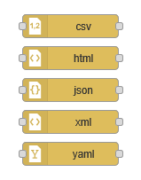
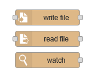

<h1 align="left">
   
  
   
  HEI-Vs Engineering School - DLS / Automation in Development and Production
   
</h1>

Course DLS/ADP

Author: [Cédric Lenoir](mailto:cedric.lenoir@hevs.ch)

# Lab 04, Management of CSV and JSON files.

## You have to learn how to use

<figure>
   
  <figcaption>Node-RED parser</figcaption>
</figure>

**and**

<figure>
   
  <figcaption>Node-RED storage</figcaption>
</figure>

### Parser

## First task

## Second task

## Remember Subflows
Here you have to write a subflow to log a button

## Fourth task